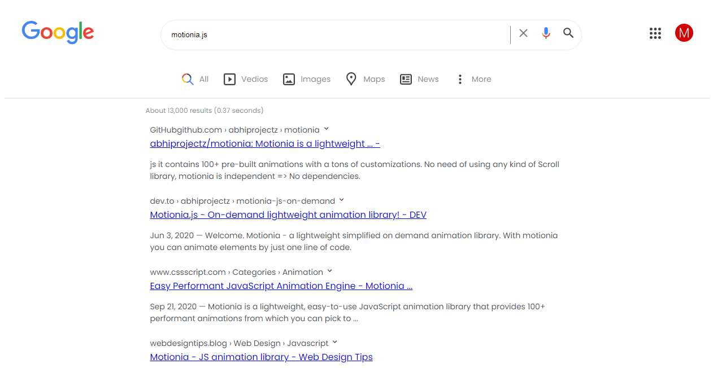

Hello there!

Ever thought to clone google search page by using just pure CSS ?
This is how you would do that, this is google search page frontend clone using pure CSS.

# Tech used:

+ CSS
+ HTML

# Preview

# STAR this if you like.